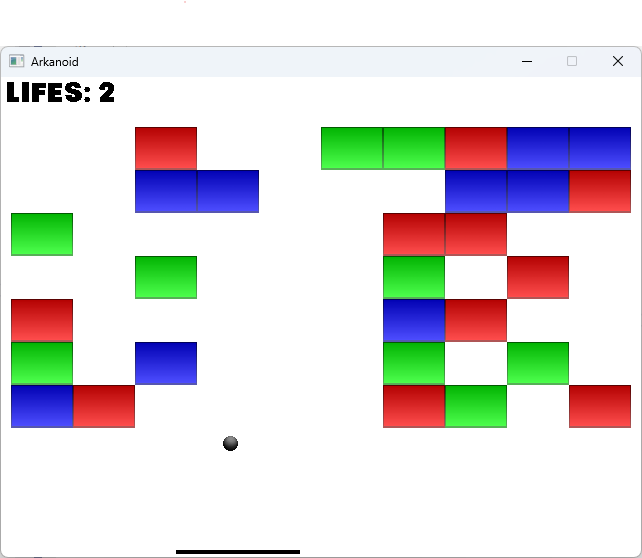

# Arkanoid

## About

A terribly simple clone of Arkanoid, done in C++ & SDL2 & Conan & CMake for fun & respect.

## Notable features
- possibly portable (due to use of STL & SDL)
- has pickups that can speed up/slow down game, increase/decrease size of paddle or ball
- attempted to improve collision detection w.r.t. tiles by using microstepping
## Keys
- R: restart
- Space: throw ball
- Esc: pause
## How to compile (Win32)

You will need CMake >=3.27 and Conan 1 or Conan 2.

Create build folder with generated 3rd party import scripts
> conan install . --settings=build_type=Release -b missing

Go to build:
> cd build

Generate solution:
> cmake .. -DCMAKE_TOOLCHAIN_FILE="generators/conan_toolchain.cmake"

Open akranoid.sln and compile it as Release.

*Note*: assets are not embededded and must be thus copied toghether with application.

## License
Unlicense license